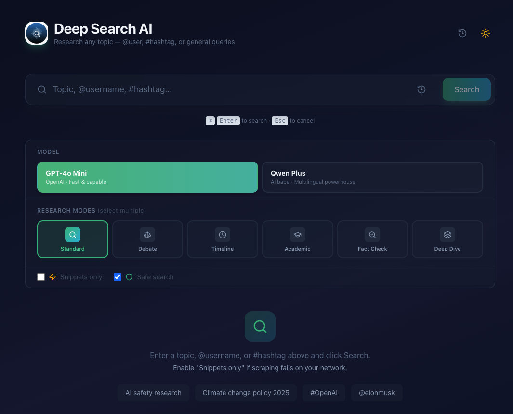

# Deep Search AI Agent



A modern AI-powered research application that performs deep web searches, scrapes content, and synthesizes structured reports with citations. Built with a multi-agent architecture featuring self-reflection, claim verification, and adaptive search depth.

## Features

**Research Modes** (multi-select — combine them)
- **Standard** — Balanced research across diverse sources
- **Debate** — Adversarial pro vs. con analysis with confidence matrix
- **Timeline** — Chronological evolution and historical context
- **Academic** — Scholarly sources, papers, and research-grade analysis
- **Fact Check** — Verify specific claims with evidence-based verdicts
- **Deep Dive** — Exhaustive research with maximum sources and depth

**AI Models**
- **GPT-4o Mini** (OpenAI) — Fast and capable
- **Qwen Plus** (Alibaba DashScope) — Multilingual powerhouse

**Agentic Features**
- **Self-Reflection** — Critic agent evaluates report quality and triggers refinement if needed
- **Claim Verification** — Cross-references key claims against source material
- **Adaptive Search Depth** — Automatically deepens research when results are sparse
- **Follow-Up Questions** — Suggests next research directions you can click to explore
- **Data Void Detection** — Warns about low-quality, echo-chamber, or unverified sources

**Core**
- Live progress streaming via SSE
- Search history and session persistence (localStorage)
- Token usage tracking with cost estimates
- Dark/light theme
- Copy and download reports as Markdown
- Keyboard shortcuts (Cmd+Enter to search, Esc to cancel)
- Safe search filtering
- Snippets-only mode for restricted networks

## Stack

| Layer | Technology |
|-------|-----------|
| Frontend | Next.js 16, React 19, Tailwind CSS 4, Lucide Icons, Sonner |
| Backend | FastAPI, Python 3.12+, LangChain, SSE |
| AI | OpenAI GPT-4o / Qwen Plus, SerpAPI / Tavily |
| Deploy | Docker Compose, multi-stage builds |

## Quick Start (Docker)

### Prerequisites

- [Docker](https://docs.docker.com/get-docker/) and Docker Compose
- API keys for OpenAI and SerpAPI (or Tavily)

### 1. Clone and configure

```bash
git clone <your-repo-url> deep-search-agent
cd deep-search-agent

# Create your config file
make setup
# or: cp .env.example .env
```

Edit `.env` and add your API keys:

```env
OPENAI_API_KEY=sk-your-openai-key
SERPAPI_API_KEY=your-serpapi-key
```

### 2. Start

```bash
make start
# or: docker compose up --build -d
```

### 3. Use

Open **http://localhost:3000** in your browser.

That's it. Both backend and frontend are running with health checks.

### Other commands

```bash
make stop        # Stop everything
make restart     # Rebuild and restart
make logs        # Follow live logs
make status      # Check container health
make clean       # Remove containers and images
```

## Local Development (no Docker)

### Backend

```bash
# Install Python dependencies
uv sync

# Start the backend (auto-reloads on changes)
make dev-backend
# or: cd backend && uv run --project .. uvicorn app.main:app --reload --port 8000
```

### Frontend

```bash
cd frontend
npm install
npm run dev
# or from root: make dev-frontend
```

Open **http://localhost:3000**.

## Configuration

All settings are in `.env`. See `.env.example` for the full list with comments.

| Variable | Required | Default | Description |
|----------|----------|---------|-------------|
| `OPENAI_API_KEY` | Yes | — | OpenAI API key |
| `OPENAI_MODEL` | No | `gpt-4o-mini` | OpenAI model name |
| `OPENAI_TEMPERATURE` | No | `0.3` | LLM temperature (0-1) |
| `QWEN_API_KEY` | No | — | Alibaba DashScope API key |
| `QWEN_MODEL` | No | `qwen-plus` | Qwen model name |
| `SERPAPI_API_KEY` | Yes* | — | SerpAPI key (*or use Tavily) |
| `SERPAPI_GL` | No | `us` | Google search country |
| `SERPAPI_HL` | No | `en` | Google search language |
| `SEARCH_PROVIDER` | No | `serpapi` | `serpapi` or `tavily` |
| `TAVILY_API_KEY` | No | — | Tavily API key (if using Tavily) |
| `SSL_VERIFY` | No | `true` | Set `false` for corporate proxies |
| `BACKEND_PORT` | No | `8000` | Backend port (Docker) |
| `FRONTEND_PORT` | No | `3000` | Frontend port (Docker) |

## API

### `GET /health`

Returns `{"status": "ok", "version": "0.2.0"}`.

### `POST /api/research`

Streams research progress via Server-Sent Events.

```json
{
  "query": "AI safety research",
  "use_snippets_only": false,
  "safe_search": true,
  "modes": ["standard", "academic"],
  "model_id": "openai"
}
```

**Modes**: `standard`, `debate`, `timeline`, `academic`, `fact_check`, `deep_dive`
**Models**: `openai`, `qwen`

## Project Structure

```
deep-search-agent/
├── backend/
│   ├── app/
│   │   ├── agent.py          # Research pipeline, agentic features
│   │   └── main.py           # FastAPI app, rate limiting, security
│   └── Dockerfile
├── frontend/
│   ├── src/app/
│   │   ├── page.tsx           # Main UI
│   │   ├── layout.tsx         # Root layout
│   │   └── globals.css        # Styles
│   └── Dockerfile
├── docker-compose.yml
├── Makefile                   # make start / stop / logs / etc.
├── requirements.txt
├── .env.example               # Template — copy to .env
└── README.md
```

## Security

- SSRF protection blocks requests to private IPs and internal networks
- Per-IP rate limiting (10 requests/minute)
- Input validation and query sanitization
- Security headers (CSP, X-Frame-Options, etc.)
- Error messages sanitized (no API keys or paths leaked)
- Non-root Docker containers
- Secrets excluded from Docker images via `.dockerignore`

## License

MIT
