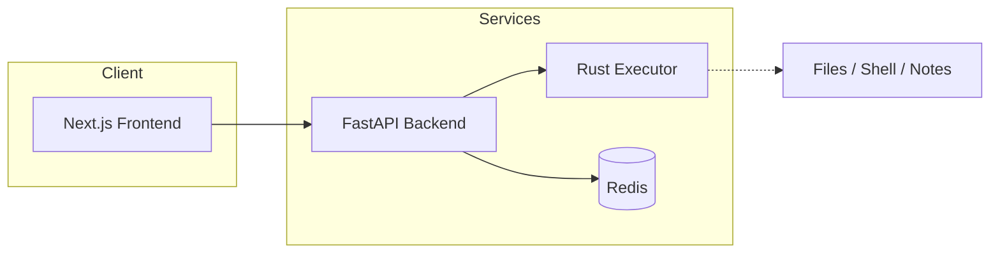

<div align="center">

# 🔬 Deep Search AI Agent

**AI-powered research that goes deeper.**

Multi-agent architecture · Self-reflection · Claim verification · RAG over your documents

<br />

[](.)
[](.)
[](.)

<br />

[Features](#-features) · [Quick Start](#-quick-start) · [API](#-api-reference) · [Security](#-security)

</div>

---

<br />

## 🎯 At a glance

<table>
<tr>
<td width="33%" align="center"><strong>🔍 8 Research Modes</strong><br/><sub>Standard, Debate, Timeline, Academic, Fact Check, Deep Dive, Social, RAG</sub></td>
<td width="33%" align="center"><strong>📚 RAG Knowledge Base</strong><br/><sub>PDF, DOCX, MD, TXT · Embeddings · Hybrid retrieval</sub></td>
<td width="33%" align="center"><strong>🤖 6 Assistant Skills</strong><br/><sub>Tasks, Calendar, Files, Email, Research, Actions (Rust)</sub></td>
</tr>
</table>

<br />

## 🛠 Tech & stack

<div align="center">

**Frontend & Backend**


**Infrastructure & AI**


</div>

<br />

## 📑 Table of contents

| | | |
|:---|:---|:---|
| [🎬 Video demo](#-video-demo) | [✨ Features](#-features) | [🛠 Tech stack](#-tech--stack) |
| [🏗 Architecture](#-architecture) | [🚀 Quick start](#-quick-start) | [⚙️ Configuration](#️-configuration) |
| [🦙 Ollama (local)](#-ollama-local-mode) | [📁 Project structure](#-project-structure) | [🔒 Security](#-security) |
| [📄 API reference](#-api-reference) | [🤖 Assistant usage](#-assistant-usage) | [📦 Distribution](#-distribution) · [🏷️ Tags](#️-tags) |

---

## 🎬 Video demo

<div align="center">


*Live research flow · RAG setup · Debate mode · Assistant with real tool execution*

</div>

---

## ✨ Features

### 🔍 Research modes *(multi-select — combine any)*

| Mode | Description |
|:-----|:------------|
| **Standard** | Balanced research across diverse sources |
| **Debate** | Adversarial pro vs. con analysis with confidence matrix |
| **Timeline** | Chronological evolution and historical context |
| **Academic** | Scholarly sources, papers, and research-grade analysis |
| **Fact Check** | Verify specific claims with evidence-based verdicts |
| **Deep Dive** | Exhaustive research with maximum sources and depth |
| **Social Media** | Community sentiment, trends, narratives, hashtag/account signals |
| **RAG** | Knowledge Base Q&A: upload documents and ask grounded questions |

---

### 📚 RAG / Knowledge base

| Capability | Details |
|:-----------|:--------|
| **Formats** | PDF, DOCX, MD, TXT; folders and zip archives |
| **Ingest** | Magic-byte detection, MIME sniffing, content-hash (SHA-256) caching |
| **Chunking** | Sentence-aware splitting, overlap, per-chunk deduplication |
| **Embeddings** | Persistent in SQLite (OpenAI or hash-based fallback) |
| **Retrieval** | **KB Only** · **Web Only** · **Hybrid** (default) |
| **Quality** | Conflict detection (KB vs. Web), citation verification, coverage gap analysis |

---

### 🤖 AI assistant *(Rust executor)*

| Skill | Description |
|:------|:------------|
| **Notes & Tasks** | Add, complete, manage to-dos; data persists in browser |
| **Calendar** | Add events, today’s agenda, free slots, weekly overview |
| **Files & Folders** | Scan folder, list by type, organise, find large/duplicate/old, generate scripts |
| **Email** | Gmail (OAuth, read-only): summarise unread, search inbox |
| **Research** | Query and synthesise past Deep Search sessions |
| **Actions** | Real ops via executor: files, notes, shell, clipboard; R2/R3 need approval |

**Flow:** User message → LLM picks tool → Rust executor runs (R0–R3 policy) → Destructive actions show Approve/Deny in UI → Results via SSE, with undo.

A **heartbeat** runs periodically; the LLM can surface alerts (e.g. pending tasks, upcoming events).

---

### 🧠 Agentic behaviour

- **Self-reflection** — Critic agent evaluates report quality and triggers refinement  
- **Claim verification** — Cross-checks key claims against sources  
- **Adaptive search depth** — Deepens research when results are sparse  
- **Follow-up questions** — Suggests next directions you can click  
- **Data void detection** — Warns about low-quality or unverified sources  

---

### ⚡ Core UX

SSE live streaming · Search history · Token usage · Dark/light theme · Copy/download Markdown · ⌘+Enter search, Esc cancel · Safe search · Snippets-only mode

---

## 🛠 Tech stack *(detail)*

| Layer | Technology |
|:------|:-----------|
| **Frontend** | Next.js 16, React 19, Tailwind CSS 4, Lucide Icons, Sonner |
| **Backend** | FastAPI, Python 3.12+, LangChain, SSE |
| **AI** | OpenAI GPT-4o, Anthropic, Qwen, Ollama, Inception; SerpAPI / Tavily |
| **Storage** | SQLite (WAL) for debate, KB, semantic cache |
| **Cache** | Redis 7 |
| **Executor** | Rust (Axum), 16 tools, sandbox, approval flows, undo/rollback |
| **Deploy** | Docker Compose, multi-stage builds |

---

## 🏗 Architecture



*Frontend → Backend (with Redis); Backend → Executor for assistant actions.*

---

## 🚀 Quick start

### Prerequisites

- [Docker](https://docs.docker.com/get-docker/) and Docker Compose  
- API keys: one LLM provider (e.g. OpenAI) and one search provider (SerpAPI or Tavily)

### 1. Clone and configure

```bash
git clone <your-repo-url> deep-search-agent
cd deep-search-agent
make setup
```

Edit `.env` and set at least:

```env
OPENAI_API_KEY=sk-your-openai-key
SERPAPI_API_KEY=your-serpapi-key
```

### 2. Start stack

```bash
make start
```

Starts **Redis** → **Executor** (Rust) → **Backend** (FastAPI) → **Frontend** (Next.js). Backend waits for Redis health.

### 3. Open app

| Environment | URL |
|:------------|:----|
| Default (compose) | **http://localhost:3001** |
| If `FRONTEND_PORT=3000` in `.env` | **http://localhost:3000** |

On first launch: choose LLM + search provider and enter keys in the in-app setup; settings are persisted to `.env` when writable.

> **Tip:** Run `make logs` to follow output; `make status` to check container health.

---

### Make commands

| Command | Description |
|:--------|:------------|
| `make setup` | Create `.env` from template |
| `make start` | Build and start all services |
| `make stop` | Stop all services |
| `make restart` | Rebuild and restart |
| `make logs` | Follow all logs |
| `make logs-backend` | Backend only |
| `make logs-frontend` | Frontend only |
| `make status` | Container health |
| `make clean` | Remove containers, images, volumes |
| `make dist` | Build shareable package in `./dist` |
| `make dev-backend` | Run backend locally (no Docker) |
| `make dev-frontend` | Run frontend locally (no Docker) |

---

## ⚙️ Configuration

All settings live in `.env`; see `.env.example` for the full list.

| Variable | Required | Default | Description |
|:---------|:--------:|:--------|:------------|
| `OPENAI_API_KEY` | ✅ | — | OpenAI API key |
| `OPENAI_MODEL` | | `gpt-4o-mini` | Model name |
| `SERPAPI_API_KEY` | ✅* | — | SerpAPI key (*or Tavily) |
| `SEARCH_PROVIDER` | | `serpapi` | `serpapi`, `tavily`, or `searxng` |
| `TAVILY_API_KEY` | | — | If using Tavily |
| `SEARXNG_URL` | | — | Base URL of SearxNG instance (e.g. `http://searxng:8080` in Docker) |
| `SEARXNG_TIMEOUT_SECONDS` | | `10` | Request timeout for SearxNG |
| `SEARCH_PROVIDER_DEFAULT` | | — | Default provider when not set per request (falls back to `SEARCH_PROVIDER`) |
| `SEARCH_PROVIDER_FALLBACKS` | | — | Optional comma-separated list (e.g. `tavily,serpapi`) to try if primary fails |
| `SSL_VERIFY` | | `true` | Set `false` for corporate proxies |
| `BACKEND_PORT` | | `8000` | Backend port |
| `FRONTEND_PORT` | | `3000` / `3001` (compose) | Frontend port |
| `REDIS_PORT` | | `6379` | Redis port |
| `EXECUTOR_URL` | | `http://127.0.0.1:7777` | Executor URL (Docker: `http://executor:7777`) |

---

## 🦙 Ollama (local mode)

Use [Ollama](https://ollama.com) to run open-source LLMs locally with no API keys. The app discovers models from your Ollama instance automatically.

### Installing Ollama

1. **Download and install** from [ollama.com](https://ollama.com) (macOS, Linux, Windows).
2. **Start Ollama** — it usually runs in the background after install. To start the server manually:
   ```bash
   ollama serve
   ```
3. **Pull a model** (e.g. Phi, Llama, Mistral):
   ```bash
   ollama pull phi
   ollama list   # list installed models
   ```

### Using Ollama with this app

1. **Set your default provider and model** in `.env`:
   ```env
   DEFAULT_MODEL_PROVIDER=ollama
   OLLAMA_MODEL=phi
   OLLAMA_BASE_URL=http://host.docker.internal:11434/v1
   ```
   - If the app runs **in Docker** (e.g. `make start`), use `http://host.docker.internal:11434/v1` so containers can reach Ollama on your host.
   - If the app runs **on the host** (no Docker), use `http://localhost:11434/v1`.

2. **In the app:** Open the setup modal, choose **Ollama (Local)** as the LLM provider, and pick a model. The model list is loaded from Ollama and updates when you pull new models — no rebuild needed.

3. **Optional:** You can change the Ollama base URL in the setup form (e.g. for a remote Ollama server).

---

## SearxNG (self-hosted search)

Use a self-hosted [SearxNG](https://docs.searxng.org/) metasearch engine as the web search provider. No API key is required; the service runs inside Docker and is not exposed to the host by default.

### Starting SearxNG with Docker Compose

Run the full stack (including SearxNG) with:

```bash
docker compose up
```

This starts `searxng`, `backend`, and `frontend`. The SearxNG container listens on port 8080 **inside** the Docker network only; no host port is published, so the search engine is not reachable from your machine except via the app.

The project includes `searxng/settings.yml`, which enables the **JSON** output format (required for the backend; without it, SearxNG returns 403 Forbidden for `format=json`). If you replace this file or use your own volume, ensure `search.formats` includes `json`. After changing settings, restart the container: `docker compose restart searxng`.

### Environment variables

| Variable | Description |
|:---------|:------------|
| `SEARXNG_URL` | Base URL of the SearxNG instance. In Docker Compose this is set to `http://searxng:8080` for the backend. |
| `SEARXNG_TIMEOUT_SECONDS` | Timeout in seconds for each SearxNG request (default: `10`). |
| `SEARCH_PROVIDER_DEFAULT` | Default search provider when the client does not send one (e.g. `searxng`). |
| `SEARCH_PROVIDER_FALLBACKS` | Optional. Comma-separated list of providers to try if the primary fails (e.g. `tavily,serpapi`). Off if unset. |

### Using SearxNG in the app

1. In the app setup, choose **SearxNG (Self-hosted)** as the search provider. No API key is required.
2. Run a search as usual; results are fetched from your SearxNG instance.

### Accessing the SearxNG web UI

By default, SearxNG is not exposed on the host. To use its web UI (e.g. for debugging or direct search), temporarily add a port mapping in your compose file:

```yaml
searxng:
  image: searxng/searxng:latest
  ports:
    - "8080:8080"
  # ... rest unchanged
```

Then open `http://localhost:8080`. Remove the `ports` block when you no longer need host access.

---

## 📁 Project structure

```
deep-search-agent/
├── backend/                 # FastAPI, research pipeline, KB, debate
│   ├── app/
│   │   ├── main.py          # Endpoints, rate limiting, security
│   │   ├── agent.py         # Research pipeline, agentic features
│   │   ├── assistant_agent.py
│   │   ├── executor_client.py
│   │   ├── kb_*.py          # Knowledge Base
│   │   ├── debate_engine.py
│   │   └── ...
│   └── Dockerfile
├── executor-rust/           # Rust executor (Axum, 16 tools)
│   ├── src/
│   │   ├── main.rs          # HTTP server, approval flow, SSE
│   │   ├── policy.rs        # Risk R0–R3, sandbox
│   │   ├── tools/           # fs, shell, notes, clipboard, etc.
│   │   ├── approval.rs, audit.rs, rollback.rs, scheduler.rs
│   │   └── ...
│   └── Dockerfile
├── frontend/                # Next.js
│   ├── src/app/
│   │   ├── assistant/       # Assistant UI
│   │   ├── search/          # Research UI
│   │   └── api/assistant/   # Proxies (act, approve, heartbeat, events)
│   └── Dockerfile
├── docker-compose.yml       # Redis, executor, backend, frontend
├── Makefile
└── README.md
```

---

## 🔒 Security

| Area | Measures |
|:-----|:---------|
| **Network** | SSRF protection; blocks private IPs and internal networks |
| **Rate limiting** | Per-IP, 10 req/min |
| **Input** | Query sanitization, UUID validation, control-char stripping |
| **Headers** | CSP, X-Frame-Options, X-Content-Type-Options, etc. |
| **Errors** | No API keys or paths in responses |
| **Docker** | Non-root; `.env` excluded via `.dockerignore` |
| **Executor** | Workspace sandbox, path traversal prevention, R0–R3 approval |
| **Audit** | JSONL logs with secret redaction |
| **Download** | http/https only; no localhost/private hosts |
| **Shell** | Command length cap 8KB; sanitized notes paths |

> ⚠️ **Do not commit `.env`** — it contains API keys. Keep it in `.gitignore`.

---

## 📄 API reference

### Health

**`GET /health`** → `{"status": "ok", "version": "0.2.0"}`

---

### Research

**`POST /api/research`** — Streams progress via SSE.

```json
{
  "query": "AI safety research",
  "use_snippets_only": false,
  "safe_search": true,
  "modes": ["standard", "academic"],
  "model_id": "openai"
}
```

**Modes:** `standard` · `debate` · `timeline` · `academic` · `fact_check` · `deep_dive` · `social_media` · `rag`  
**Models:** `openai` · `anthropic` · `grok` · `mistral` · `gemini` · `deepseek` · `qwen` · `ollama` · `inception`

---

### Knowledge base

| Method | Endpoint | Description |
|:-------|:---------|:------------|
| `POST` | `/api/kb/create` | Create KB |
| `GET` | `/api/kb/list` | List KBs |
| `GET` | `/api/kb/{kb_id}/docs` | List docs in KB |
| `DELETE` | `/api/kb/{kb_id}` | Delete KB |
| `POST` | `/api/kb/{kb_id}/upload` | Upload files (multipart) |
| `POST` | `/api/kb/{kb_id}/upload-zip` | Upload zip |

---

### RAG

| Method | Endpoint | Description |
|:-------|:---------|:------------|
| `POST` | `/api/rag/query` | Sync RAG query |
| `POST` | `/api/rag/query/stream` | SSE streaming |

**Scopes:** `KB_ONLY` · `WEB_ONLY` · `HYBRID` (default)

---

### Assistant

| Method | Endpoint | Description |
|:-------|:---------|:------------|
| `GET` | `/api/assistant/status` | Executor available? |
| `POST` | `/api/assistant/act` | Execute from natural-language message |
| `POST` | `/api/assistant/approve` | Approve/deny destructive action |
| `POST` | `/api/assistant/heartbeat` | Heartbeat (tasks, calendar context) |
| `GET` | `/api/assistant/runs/{run_id}/events` | SSE run events |

**Act body example:**

```json
{
  "message": "list files in ~/Downloads",
  "run_id": "optional-uuid",
  "context": { "path": "~/Downloads" }
}
```

**Tools:** `fs_list`, `fs_read`, `fs_stat`, `fs_write`, `fs_append`, `fs_copy`, `fs_move`, `fs_rename`, `fs_delete`, `net_download`, `archive_extract`, `shell_run`, `notes_*`, `clipboard_read`, `clipboard_write`

---

### Executor (Rust)

- **Docker:** Service `executor`, `http://executor:7777`, started with `make start`.  
- **Local:** `cd executor-rust && cargo run` (binds `127.0.0.1:7777`).

Provides: 16 tools, R0–R3 policy, approval flow, undo/rollback, scheduler, JSONL audit with redaction.

---

## 🤖 Assistant usage

Assistant UI: **http://localhost:3000/assistant** (or your `FRONTEND_PORT`). Six skills in the sidebar.

### Getting started

1. **Docker:** `make start` — backend, frontend, Redis, executor all start; Actions show “Ready” when executor is up.  
2. **Local:** Start backend + frontend, then `cd executor-rust && cargo run` for Actions.  
3. Open `/assistant`, pick a skill, and chat.

If Actions says *“Start the executor to enable real actions”*, the backend cannot reach the executor (check services or run executor locally).

### Skills in short

| Skill | Example prompts |
|:------|:----------------|
| **Tasks** | “Add task: Buy groceries”, “Show my tasks”, “Complete #1” |
| **Calendar** | “Add event: Standup tomorrow 10am”, “Today’s agenda”, “Free slots” |
| **Files & Folders** | “Scan a folder” → “List CSV files”, “Organise into subfolders”, “Script to archive old files” |
| **Email** | Connect Gmail → “Summarise unread”, “Search for project deadline” |
| **Research** | Query past Deep Search sessions |
| **Actions** | “List files in ~/Downloads”, “Read ~/notes.txt”, “Put data.csv in trash” (approval), “Run ls -la” (approval) |

Destructive actions show **Approve / Deny** at the bottom of the chat.

---

## 📦 Distribution

```bash
make dist
```

Produces `dist/deep-search-agent/` and `dist/deep-search-agent.tar.gz`. Ensure `.env` is not included before sharing.

---

## 🏷️ Tags

<div align="center">

`ai-agent` · `research` · `rag` · `knowledge-base` · `llm` · `openai` · `anthropic` · `ollama` · `langchain` · `fastapi` · `nextjs` · `react` · `rust` · `docker` · `redis` · `sqlite` · `semantic-search` · `embeddings` · `sse` · `streaming` · `debate` · `fact-check` · `academic` · `serpapi` · `tavily` · `assistant` · `tools` · `executor` · `multi-agent` · `self-reflection` · `claim-verification` · `pdf` · `docx` · `chunking` · `tailwind` · `typescript` · `python` · `axum` · `mit-license`

</div>

---

<div align="center">

**License** — [MIT](.)

</div>
